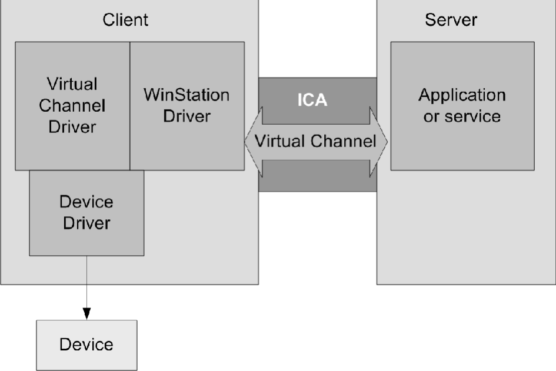

# Architecture

A Citrix Independent Computing Architecture (ICA) virtual channel is a
bidirectional error-free connection for the exchange of generalized
packet data between a server running Citrix XenApp and a client device.
Developers can use virtual channels to add functionality to clients.
Uses for virtual channels include:

-  Support for administrative functions

-  New data streams (audio and video)

-  New devices, such as scanners, card readers, and joysticks)

## Virtual Channel Overview

An ICA virtual channel is a bidirectional error-free connection for the
exchange of generalized packet data between a client and a server
running Citrix XenApp or XenDesktop. Each implementation of an ICA
virtual channel consists of two components:

### Server-side portion on the computer running XenApp or XenDesktop

The virtual channel on the server side is a normal Win32 process; it can
be either an application or a Windows NT service.

### Client-side portion on the client device

The client-side virtual channel driver is a dynamically loadable module
(.DLL) that executes in the context of the client. You must write your
virtual driver.

This figure illustrates the virtual channel client-server connection:

The WinStation driver is responsible for demultiplexing the virtual
channel data from the ICA data stream and routing it to the correct
processing module (in this case, the virtual driver). The WinStation
driver is also responsible for gathering and sending virtual channel
data to the server over the ICA connection.

The following is an overview of client-server data exchange using a
virtual channel:

1.  The client connects to the server running XenApp or XenDesktop. The
    client passes information about the virtual channels it supports to
    the server.

1.  The server-side application starts, obtains a handle to the virtual
    channel, and optionally queries for additional information about
    the channel.

1.  The client-side virtual driver and server-side application pass data
    using the following two methods:

    -  If the server application has data to send to the client, the data
    is sent to the client immediately. When the client receives the
    data, the WinStation driver demultiplexes the virtual channel data
    from the ICA stream and passes it immediately to the client
    virtual driver.

    -  If the client virtual driver has data to send to the server, the
    data is sent by using the QueueVirtualWrite call for the newly
    written virtual drivers. The data can be sent at any point that the
    virtual driver is processing the main process control flow. Do not
    send data from a thread within a virtual driver. Note that there is
    no way to alert the server virtual channel application that the data
    was received.

1.  When the server virtual channel application is finished, it closes
    the virtual channel and frees any allocated resources.

## ICA and Virtual Channel Data Packets

Virtual channel data packets are encapsulated in the ICA stream between
the client and the servers. Because ICA is a presentation-level protocol
and runs over several different transports, the virtual channel
application programming interface (API) enables developers to write
their protocols without worrying about the underlying transport. The
data packet is preserved.

For example, if 100 bytes are sent to the server, the same 100 bytes are
received by the server when the virtual channel is demultiplexed from
the ICA data stream. The compiled code runs independently of the
currently configured transport protocol.

The ICA engine provides the following services to the virtual channel:

### Packet encapsulation

ICA virtual channels are packet-based, meaning that if one side performs
a write with a certain amount of data, the other side receives the
entire block of data when it performs a read. This contrasts with TCP,
for example, which is stream-based and requires a higher-level protocol
to parse out packet boundaries. Stated another way, virtual channel
packets are contained within the ICA stream, which is managed separately
by system software.

#### Error correction

ICA provides its own reliability mechanisms even when the underlying
transport is unreliable. This guarantees that connections are error free
and that data is received in the order in which it is sent.

#### Flow control

The virtual channel API provides several types of flow control. This
allows designers to structure their channels to handle only a specific
amount of data at any one time. See Flow Control for more information.

## Client WinStation Driver and Virtual Driver Interaction

The WinStation driver calls into the virtual driver on the event
callbacks, timer callbacks, and on the periodic call to the DriverPoll
function. The client runtime environment is single threaded and
nonpreemptive; therefore, the virtual driver you write must never block.
When control flow is passed to the virtual driver, the virtual driver
must immediately perform the required operations and return control to
the WinStation driver.

Because all transfers to the server require reserving an output buffer
and buffers might be temporarily unavailable, the virtual driver must be
prepared to delay sending all output until a later point.

The following process occurs when a user starts the client:

1.  At client load time, the client engine
    reads the Configuration Storage in the configuration files to
    determine the modules to configure, including how to configure the
    virtual channel drivers.

1.  The client engine loads the virtual channel drivers defined in the
    Configuration Storage in the configuration files by calling the Load
    function, which must be exported explicitly by the virtual channel
    driver .DLL. The Load function is defined in the static library file
    vdapi.a, which is provided in this SDK. Every driver must link with
    this library file. The Load function forwards the driver entry
    points defined in the .DLL to the client engine.

1.  For each virtual channel, the WinStation driver calls the DriverOpen
    function, which establishes and initializes the virtual channel. The
    WinStation driver passes the addresses of the output buffer
    management functions in the WinStation driver to the virtual
    channel driver. The virtual channel driver passes the address of the
    ICADataArrival function to the WinStation driver. The WinStation driver calls the DriverOpen function for each virtual driver when
    the client loads, not when the virtual channel is opened by the
    server-side application.

1.  When virtual channel data arrives from the server, the WinStation
    driver calls the ICADataArrival function for that virtual driver.

1.  To send data, the virtual channel driver has two options:

    -  To use the QueueVirtualWrite function which is simple to use and
    offers the option for immediate data transfer. This is the method
    that should be used for all new virtual drivers.

    -  To use the **deprecated** client-side helper functions (these
    addresses are obtained during initialization) to reserve an output
    buffer, fill it with data, and write the buffer.

1.  Outgoing data must be placed in the WinStation driver’s output
    buffers for transmission to the host. Checks for available space
    using OutBufReserve.

1.  Fills in the buffer using AppendVdHeader and OutBufAppend.

1.  Writes the data using OutBufWrite.

The WinStation driver does not preserve the output buffer data between
calls to the virtual driver, so the virtual driver must complete the
data output process before returning control.

## Module.ini

The Workspace apps use settings stored in Module.ini to determine which
virtual channels to load. Driver developers can also use Module.ini to
store parameters for virtual channels. Module.ini changes are effective
only before the installation. After the installation, you must modify
the Configuration Storage in the configuration files to add or remove
virtual channels.

Use the memory INI functions to read data from Configuration Storage.

## Virtual Channel Packets

ICA does not define the contents of a virtual channel packet. The
contents are specific to the particular virtual channel and are not
interpreted or managed by the ICA data stream manager. You must develop
your own protocol for the virtual channel data.

A virtual channel packet can be any length up to the maximum size
supported by the ICA connection. This size is independent of size
restrictions on the lower-layer transport. These restrictions affect the
server-side WFVirtualChannelRead and WFVirtualChannelWrite functions and
the QueueVirtualWrite and SendData functions on the client side. The
maximum packet size is 5000 bytes (4996 data bytes plus 4 bytes of
packet overhead generated by the ICA datastream manager).

Both the virtual driver and the server-side application can query the
maximum packet size. See DriverOpen for an example of querying the
maximum packet size on the client side.

## Flow Control

ICA virtual channels provide support for downstream (server to client)
flow control, but there is currently no support for upstream flow
control. Data received by the server is queued until used.

Some transport protocols such as TCP/IP provide flow control, while
others do not. If data flow control is needed, you might need to design
it into your virtual channel.

Choose one of three types of flow control for an ICA virtual channel:
**None**, **Delay**, or **ACK**. Each virtual channel can have its own
flow control method. The flow control method is specified by the virtual
driver during initialization.

### None

ICA does not control the flow of data. It is assumed the client can
process all data sent. You must implement any required flow control as
part of the virtual channel protocol. This method is the most difficult
to implement but provides the greatest flexibility. The Ping example
does not use flow control and does not require it.

### Delay

Delay flow control is a simple method of pacing the data sent from the
server. When the client virtual driver specifies delay flow control, it
also provides a delay time in milliseconds. The server waits for the
specified delay time between each packet of data it sends.

### ACK

ACK flow control provides what is referred to as a sliding window. With
ACK flow control, the client specifies its maximum buffer size (the
maximum amount of data it can handle at any one time). The server sends
up to that amount of data. The client virtual driver sends an ACK ICA
packet when it completes processing all or part of its buffer,
indicating how much data was processed. The server can then send more
data bytes up to the number of bytes acknowledged by the client.

This ACK is not transparent—the virtual driver must explicitly construct
the ACK packet and send it to the server. The server sends entire
packets; if the next packet to be sent is larger than the window, the
server blocks the send until the window is large enough to accommodate
the entire packet.