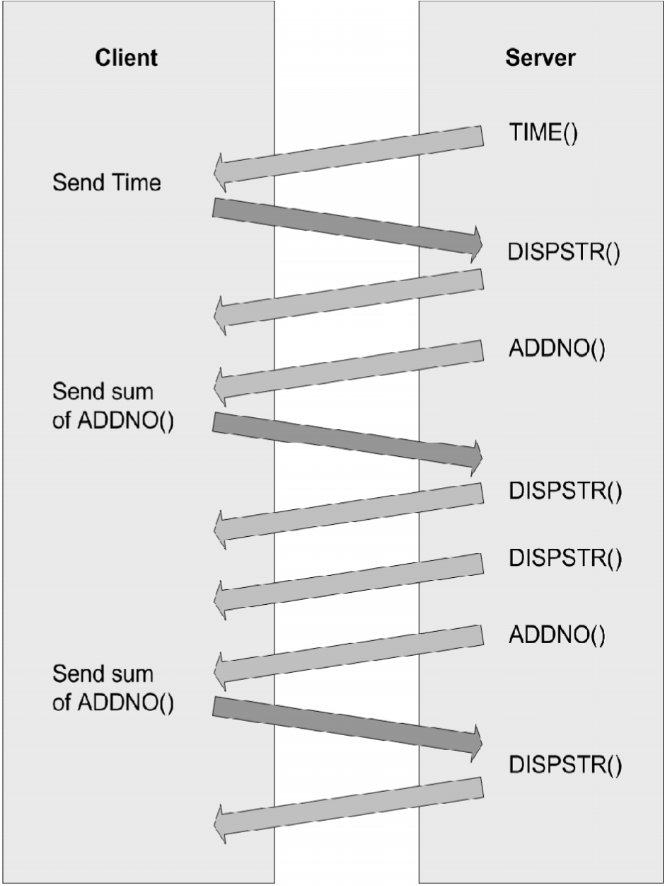
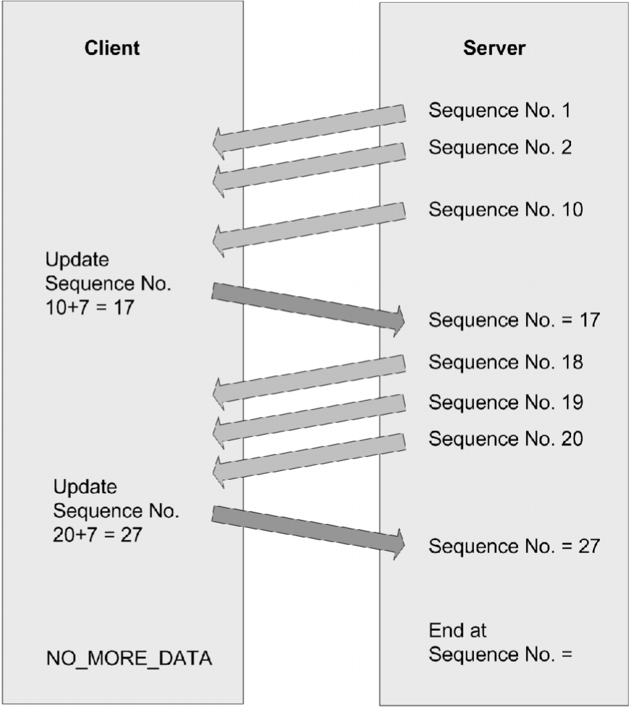

# Using Example Programs


The example programs included with the Virtual Channel SDK are
buildable, working virtual channels. Use these examples to:

-   Verify your Virtual Channel SDK installation is correct by building
    a known working example program.

-   Provide working examples of code that can be modified to suit
    your requirements.

-   Explore the features and functionality provided in the Virtual
    Channel SDK.

Each of these example programs comprises a client virtual driver and a
server application. The server-side application is run from the command
line within an ICA session. A single virtual channel comprises an
application pair.

The example programs included with the Virtual Channel SDK are:

**Ping**: Records the round-trip delay time for a test packet sent over
a virtual channel.

**Mix**: Demonstrates a mechanism to call functions (for example, to get
the time of day) on a remote client.

**Over**: Simple asynchronous application that demonstrates how to code
an application where the server must receive a response from the client
asynchronously, and where the type of packet being sent to the client is
different from the type received.

**OXS**: Demonstrates sub-window or overlay buffers, events, and timers.

Each example includes a description of the program, packet format, and
other necessary information.

## Ping

Ping is a simple program that records the round-trip delay time for a
test packet sent over a virtual channel. The server sends a packet to
the client and the client responds with a packet containing the time it
received the original packet from the server. This sequence is repeated
a specified number of times, and then the program displays the
round-trip time for each ping and the average round-trip delay time.

For this example, there is no significant difference between a BEGIN
packet and an END packet. The two types of packets are provided as an
example for writing your own virtual channel protocols.

This program demonstrates:

-   How to transfer data synchronously. The sequence of events is:
    {SrvWrite, ClntRead, ClntWrite, SrvRead} {SrvWrite, ClntRead} {...}.
    The server waits for the client to reply before sending the
    next packet.

-   How to read parameter data (in this case, the number of times to
    send packets to the client) from the Module.ini files.

### Packet Format

The following packet is exchanged between the client and the server.
```
typedef struct PING {
	USHORT 		uSign; 			// Signature
	USHORT 		uType; 			// Type, BEGIN or END, from server
	USHORT 		uLen; 			// Packet length from server
	USHORT 		uCounter; 		// Sequencer
	ULONG 		ulServerMS; 	// Server millisecond clock
	ULONG 		ulClientMS; 	// Client millisecond clock
} PING, *PPING;
```
## Mix


Mix demonstrates a mechanism that can be used to call functions on a
remote client (for example to get the time of day). This program
demonstrates an extensible scheme for making function calls from the
server to the client that allows the server to specify when it expects a
response from the client and when it does not. This method can increase
performance, because the server does not have to constantly wait for a
reply from the client.

The server calls a series of simple functions:

-   **AddNo**: Add two numbers and return the sum as the return value.

-   **DispStr**: Write a string to the log file. There is no return
    value (write-only function).

-   **Gettime**: Read the client time and return it as the return value.

The actual implementation of these functions is on the client side. The
server conditionally waits for the response from the client, depending
on the function being executed. For example, the server waits for the
result of the AddNo or Gettime function, but not the write-only function
DispStr, which returns no result.

### Packet Format

```
typedef struct MIXHEAD {
	USHORT 		uType 			// Packet type
	USHORT 		uFunc; 			// Index of Function
	ULONG 		uLen; 			// Length of data
	USHORT 		fRetReq; 		// True if return value required
	ULONG 		dwRetVal; 		// Return Value from client
	USHORT 		dwLen1; 		// length of data for \#1 LpVoid
	USHORT 		dwLen2; 		// length of data for \#2 LpVoid
} MIXHEAD, *PMIXHEAD;
```
The data consists of the above structure followed by the arguments to
the function being called. uLen is the total length of the data being
sent, including the arguments. DwLen1 is the length of the data pointed
to by a pointer argument.

### Sequence of Events

The Mix program demonstrates the following sequence of events. See the
graphic on the next page.

This figure illustrates the sequence of events that occurs when you use
the Mix program, starting at the top.



## Over


Over is a simple asynchronous application. It demonstrates how to code
an application in which the server must receive a response from the
client asynchronously, and the type of packet being sent to the client
is different from the type received.

When the Over program begins, it:

1.  Spawns a thread that waits for a response from the client.

2.  Begins sending data packets with sequence numbers to the client.

3.  (After sending the last packet of data) sends a packet with a
    sequence number of NO_MORE_DATA, and then closes the connection.

The client receives packets and inspects the sequence number. For every
sequence number divisible by 10, the client increases the sequence
number by 7 and sends a response to the server. These numbers are chosen
arbitrarily to demonstrate that the client can asynchronously send data
to the server at any time.

The packet type used to send data from the server to the client is
different from the packet type used to receive data from the client.

### Packet Format - From Server to Client

```
typedef struct OVER {
	USHORT 		uSign; 			// Signature
	USHORT 		uType; 			// Type, BEGIN or END, from server
	USHORT 		uLen; 			// Packet length from server
	USHORT 		uCounter; 		// Sequencer
	ULONG 		ulServerMS; 	// Server millisecond clock
} OVER, *POVER;
```

### Packet Format - From Client to Server

```
typedef struct DRVRESP {
	USHORT 		uType; 			// Type OVERFLOW_JUMP from client
	USHORT 		uLen; 			// Packet length from client
	USHORT 		uCounter; 		// seqUencer
} DRVRESP, * PDRVRESP;
```
### Sequence of Events

This figure illustrates the sequence of events that occurs when you
use the Over program, starting at the top.



## OXS

OXS is the Noughts and Crosses game. The OXS virtual channel implements
remote drawing of this game. The purpose of this is to demonstrate the
following interfaces, which are specific to the Receiver for Linux:

-   Sub-windows or overlay buffers

-   Events (the selection of File Descriptor)

-   Timers

The client component of the OXS virtual driver implements the drawing of
the game. All processing of the game play is performed on the server. To
achieve client-side drawing, a sub-window (child) of the session window
is obtained using the sub-window interface. The sub-window is placed
over the corresponding area of the game window, and every movement to
the server-side game window is mimicked by the sub-window. This creates
the impression of a single application. Mouse clicks and interaction
with the server-side OXS application are converted into Play Move,
Winning Line, Move Window, and Close Window commands. These are received
by the virtual driver and translated into corresponding actions and X
drawing commands.

This sub-window technology is most useful for solutions such as local
video decoding. The sub-window interface is not designed to take
keyboard and mouse input. It is intended to render graphics.

In addition, the OXS virtual driver uses the events (Evt) interface.
This monitors the X server file descriptor for Expose events, which
allows a callback to redraw the game area for every event.

The OXS virtual driver also uses the timer (Tmr) interface. This works
around a race condition between the OXS and Seamless virtual channels.
Although the sub-window used for drawing mimics the movements of the
server side window, if Seamless is used a race condition occurs between
the movement of the Seamless server-side window and the sub-window. The
timer is used to delay the sub-window position update until after the
Seamless window move is complete.

Note: The sample application below is a basic one and does not use the
MM_clip api. In this case, the overlaid session sub-window is never
clipped and is always an on top square.

Clipping the session sub-window properly can give the appearance that it
is in the remote sessions window stack, even though it is actually
overlaid on top of the session. This is not something this example does.

## Building Examples

### Building a Server-side Example using Nmake

Examples of the latest server-side executables have been provided for
testing. Please download the latest Windows Virtual Channel SDK in order
to develop the server-side component.

### Building a Client-side Example using Linux

1.  To start a build, open a terminal.

2.  Change src/examples/vc/client/unix/MakeCOMMONVD to match the
    target platform.
    
    **Note:** Linux does not require pingwire.c. This is detected by the presence of the
environment variable, CROSS_COMPILER_PREFIX

1.  Set the environment variable HOST_PREFIX to the target:

	-   linux for Linux x64

	-   linux for Linux x86

	-   linuxarmhf for Linux armhf

1.  For example, to build **vdping.dll**, type: `cd src/examples/vc/client/vdping/unix` and then type `make`. The production (retail) and debug builds of vdping.dll are built in the
lib subdirectory. Pre-built production versions are provided in the
separate directories, `src/examples/vc/client/vdping/linux/obj/retail` and
`src/examples/vc/client/vdping/linuxarm/obj/retail`.

1.  Perform the same process to build all other example virtual drivers.

Alternatively to build all example Virtual Drivers, type **cd
src/examples/vc/client** and then run the **build** script.

## Configuring the Virtual Driver


1.  Copy the appropriate virtual driver for the platform to the client
    installation directory. For example, copy the Linux virtual driver,
    vdping.dll, in src/examples/vc/client/vdping/unix/lib/linux/retail
    for a locally built version, or in
    src/examples/vc/client/vdping/linux/obj/retail for a pre-built
    version to the client installation directory as VDPING.DLL.

2.  In the client installation directory, modify the file
    config/module.ini and make the following changes: 

	-   In the \[ICA 3.0\] section append “Ping” to the VirtualDriver list.

	-   In the \[ICA 3.0\] section add “Ping=On”.

1.  Add a new section \[Ping\] with the entry “DriverName=VDPING.DLL”.

2.  Copy ctxping.exe.sample from src/examples/vc/server/ctxping to the
    Citrix server and rename it to ctxping.exe.

3.  Run ctxping at the command prompt within a client session to
    implement the Ping virtual channel.

## Running an Example Virtual Channel

Examples of the latest server-side executables have been provided for
testing.

1.  On a client configured with the client-side example, connect to a
    server running XenApp or XenDesktop with the associated server-side
    example (located at base/examples/vc/server in this SDK).

2.  Within the ICA session, run the server-side executable.


The server-side example queries the client-side virtual driver, and then
displays the driver information. Use the **-d** parameter to display
detailed information.
For Ping only: CTXPING sends PingCount separate
pings. PingCount has a default value of three, but can be set in the
\[Ping\] section of the Module.ini file. Each ping consists of a BEGIN
packet and an END packet.

## Debugging a Linux Virtual Driver


Use the TRACE feature to log events on the client. To enable the TRACE
statements, you must build the debug version of the virtual driver and
create a debug.ini file in the current directory where the client is
run.

When the debug module is installed on the client, the TRACE statements
write the debug information to a file, ncs.log.&lt;process id&gt;. The
following debug.ini contents create tracing for the example virtual
channels:

```
\[ncs\]
traceFlags = +LOG_PRINTF
traceClasses = +TC_VD
traceFeatures = +TT_ALL
traceFile = ncs.log.\$\$
```

You can refine tracing by editing the traceFeatures line. For example,
"traceFeatures = +TT_API1 | TT_API2" will only print trace statements
of type TT_API1 and TT_API2.

The class flag for virtual channels is TC_VD. For the complete list of
class and event flags, see logflags.h (located in src/inc/).

1.  Compile the debug version of the virtual driver for the
    client platform.

2.  If it is running, close the client on the client device.

3.  Copy the debug version of the virtual driver to the client
    installation directory. For example, copy vdping.dll to the client
    installation directory as VDPING.DLL.

4.  Ensure that config.ini and module.ini in the client installation
    directory are updated appropriately to load the new virtual driver,
    following the instructions for loading a production version of the
    virtual driver.

5.  Create the debug.ini file in the current working directory.

6.  Launch Receiver to implement the new virtual channel.

